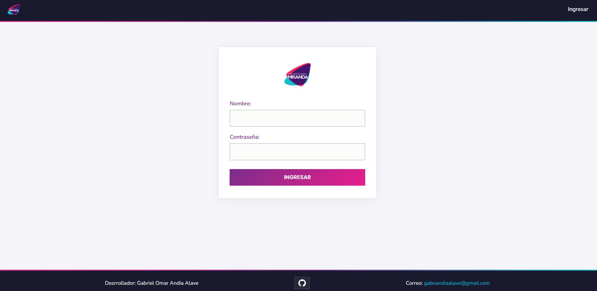
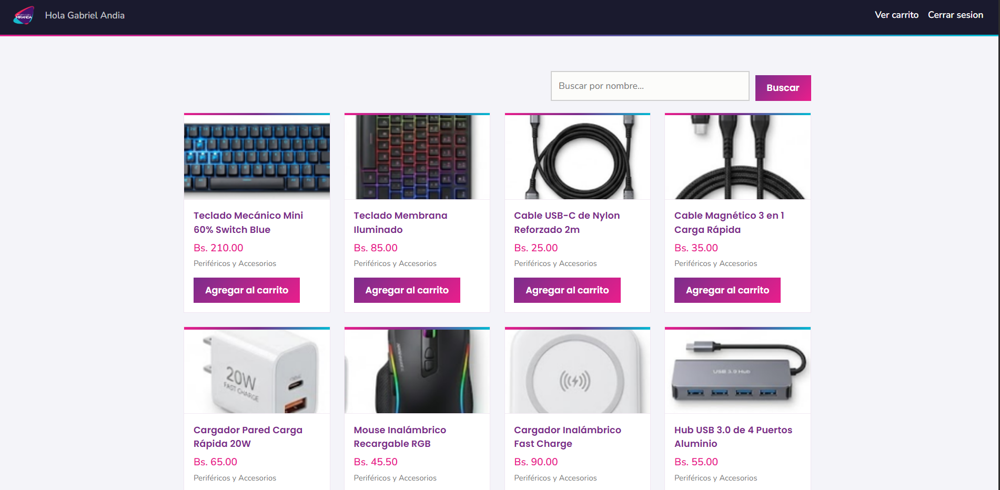
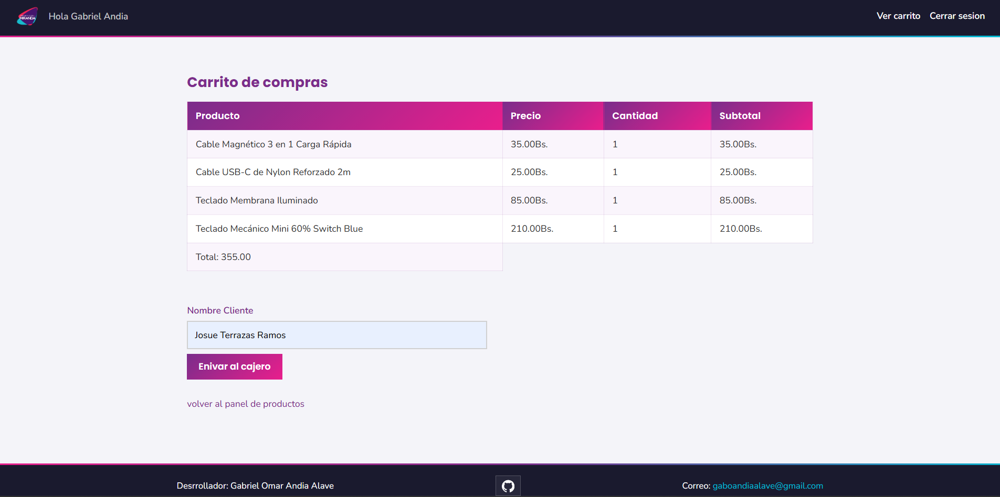
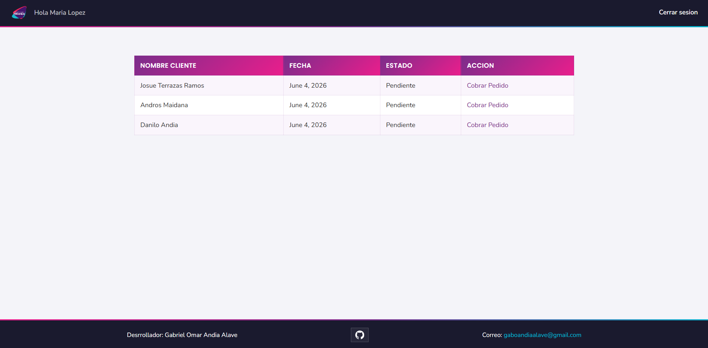
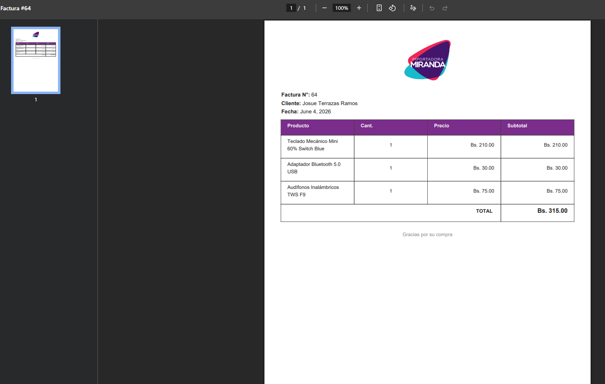
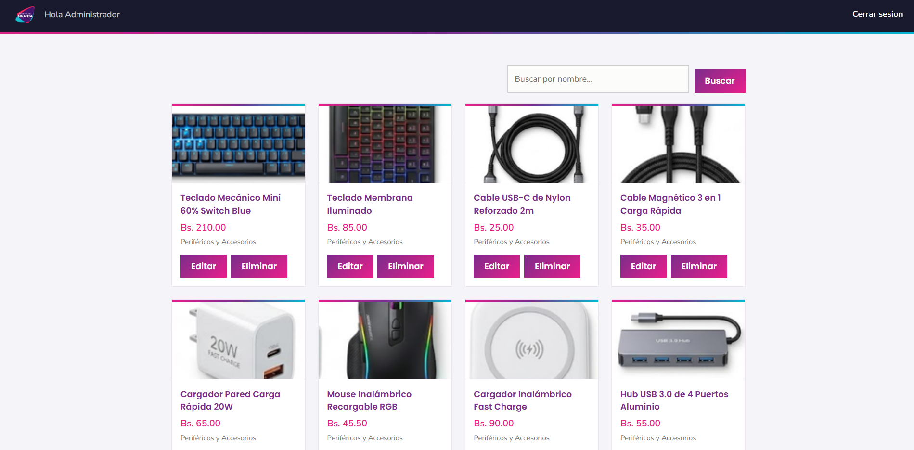
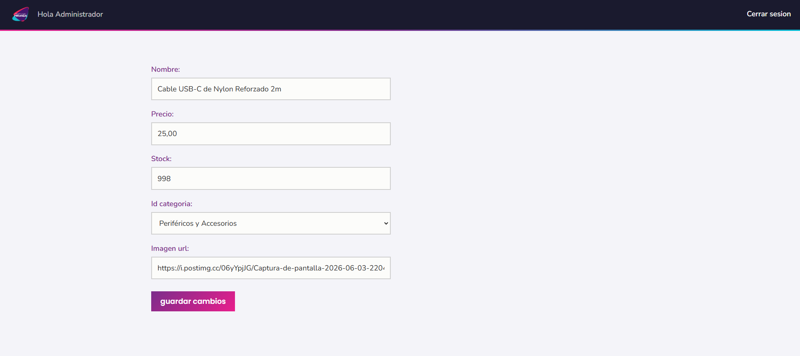

# SISTEMA IMPORTADORA 'MIRANDA'

**Desarrollado por:** Gabriel Omar Andia Alave

Sistema web transaccional desarrollado con Django y Oracle Database. Cuenta con interfaz minimalista basada en "Flat Design" de estilo escandinavo (UI/UX 100% responsiva). Gestiona flujos de caja, control de productos y carrito de compras mediante una lógica basada enteramente en sesiones y roles.

## Proposito del sistema

El propósito general del sistema es administrar el catalogo de productos de la tienda mediante el envio de seleccion de un cliente hacia el cajero; enviando el NOMBRE DEL CLIENTE y LA LISTA DE PRODUCTOS QUE EL SELECCIONO.
- El cajero al recibir la lista de productos y el nombre del cliente, procede a cobrar el pago mediante un boton que referencia al cliente, asi mismo genera la factura con los datos de los productos y el cliente
- Una vez el pago se haya cobrado o realizado en caja, el pago pendiente desaparece de la cola.
## Funcionalidades Principales

El sistema controla accesos basados en tres roles específicos (`admin`, `trabajador`, `cajero`).

1. **Admin (Administración):**
   - Panel de gestión absoluta del inventario.
   - Puede Crear, Editar y Eliminar productos directamente afectando a la base de datos Oracle.
2. **Trabajador (Vendedores):**
   - Acceso al catálogo de productos y barra de búsqueda optimizada (Django ORM `__icontains`).
   - Carrito temporal gestionado en la Memoria/Caché (`request.session['carrito']`) sin saturar la Base de Datos con envíos no aprobados.
   - Envío de Pedidos: Registra automáticamente los detalles (cantidades y subtotales) debitando el stock, almacenándolo atómicamente con `transaction.atomic()`, y dejándolo en estado "Pendiente".
3. **Cajero (Caja y Facturación):**
   - Acceso exclusivo al panel "Pendientes".
   - Encargado exclusivo de revisar la integridad de la orden y marcarla con un botón como "Cobrado", cambiando el estado definitivo del pedido en la base de datos.
   - Genera la factura al cobrar los pedidos.
4. **Login Manual Seguro:** 
   - Control nativo de identidades utilizando la tabla preexistente de Oracle `usuario`. Validación manual redireccionando automáticamente a pantallas bloqueadas según el rol del logueado.

---


## Pasos para Instalación y Despliegue

### 1. Requisitos Previos
- **Python** (versión 3.9 o superior).
- Motor de **Oracle Database** (ej: Oracle XE local o conectado a servidor remoto) o gestor como DBeaver/SQL Developer.

### 2. Configurar la Base de Datos (Oracle)
Dentro de la raíz de este proyecto encontrarás el archivo **`script_bd.sql`**. Necesitas ejecutarlo íntegramente en tu gestor de base de datos favorito.

Este script es el responsable de recrear la estructura exacta de manera independiente:
- EN ORACLE LOGUEADO CON SYSTEM, SYS O USUARIO CON PRIVILEGIOS CREAR EL SIGUIENTE USUARIO:
- `CREATE USER importadora_db IDENTIFIED BY 123456;`
- `GRANT ALL PRIVILEGES TO importadora_db;`
-  UNA VEZ EL USUARIO ESTE LISTO SIMPLEMENTE EJECUTAR EL SCRIPT script_db.sql CON ESE USUARIO PARA CREAR LA ESTRUCUTRA DE LA BASE DE DATOS Y LOS REGISTROS.


### 3. Clonar y Preparar el Proyecto (VS Code / Terminal)

```bash
# 1. Clonar el repositorio
git clone https://github.com/hiygabo/SISTEMA-IMPORTADORA-VDJANGO.git

# 2. Entrar a la carpeta raíz clonada
cd SISTEMA-IMPORTADORA-VDJANGO

# 3. Crear tu entorno virtual en Python
python -m venv venv

# 4. Activar el entorno (En powershell de Windows)
.\venv\Scripts\activate

# 5. Instalar Django y utilidades de Oracle (oracledb es el driver actual)
pip install django oracledb
```

### 4. Configuración en `settings.py`
Navega a `importadora/importadora/settings.py` y asegúrate de configurar tu conexión a Oracle. 
En la sección `DATABASES`, adapta las credenciales a las de tu sistema Oracle:

```python
DATABASES = {
    'default': {
        'ENGINE': 'django.db.backends.oracle',
        'NAME': 'localhost:1521/xe',       # <--- URL o Nombre de servicio de tu Oracle
        'USER': 'importadora_db',              # <--- Tu usuario creado en el DB
        'PASSWORD': '123456',       # <--- Contraseña del DB
        'HOST': '',
        'PORT': ''
    }
}
```

### 5. Correr el servidor
Habiendo guardado el script y la configuración, procedemos a encender la aplicación:

```bash
# Entrar a la carpeta donde vive manage.py
cd importadora

# Arrancar el servidor
python manage.py runserver
```

Visita **http://127.0.0.1:8000/** en un navegador web. El sistema reconocerá que no tienes sesión activa y te dirigirá instantáneamente al login blindado de Flat Design. 

### 6. Capturas de Pantalla
### login


### Panel de Trabajador


### Panel carrito de compras


### Panel de Cajero


### factura generada


### Panel de Admin (CRUD basico)


